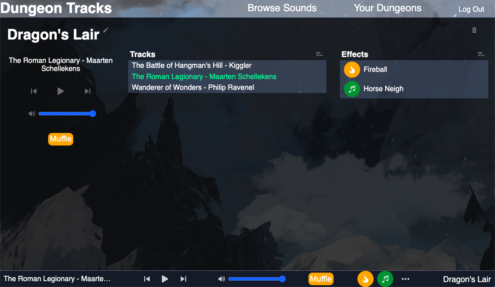

# Dungeon Tracks

Prepare and operate background music and sound effects for your TTRPGs without distracting from gameplay.

## Contents
1. [Description](#description)
2. [Future Development](#future-development)
3. [Dependencies](#dependencies)
4. [Preview](#preview)

## Description

Dungeon Tracks is a browser-based music and effects tool designed specifically for use in tabletop roleplay. Users are able to prepare and save sounds
to a dungeon (playlist) and build a collection of ambient music and sound effects. Sound can enhance the game experience for players, and the goal of this 
app is to provide a tool tailored to this purpose.

The muffle feature provides simple, one-click noise reduction without the trouble of sudden silence or messing about to find the right volume. This is
great for when you want to focus on narrative exposition or player discussion without sacrificing immersion.

## Future Development

While in its MVP stage, the application is not yet ready for general use. Future plans for the site include:
- Access to a larger sound library
- Timestamp display and time seek feature
- UX improvements

## Dependencies

Dungeon Tracks is built in [React](https://reactjs.org) with [Redux](https://redux.js.org) and served using [Express](https://expressjs.com). 
The database is managed with [MySQL](https://mysql.com).
Other major dependencies are [Howler.js](https://www.npmjs.com/package/howler), [AudioFX](https://www.npmjs.com/package/audiofx),
[Axios](https://axios-http.com), and [Styled Components](https://styled-components.com).

## Preview

